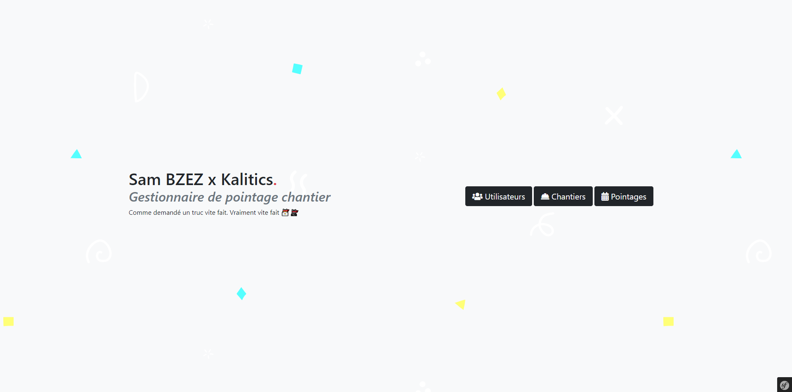

<<<<<<< HEAD
# Kalitics 
Gestionnaire de pointage SF4

## Pré-requis

- Apache/Nginx Server
- PHP > 7
- Composer
- Un cerveau
- 5 minutes à perdre

## Installation

### Installation des vendors

Executez la commande ``composer install``  a la racine de votre dossier.

### Création de la base de données

Executez la commande ``php bin/console doctrine:database:create``.

### Migration

Executez la commande ``php bin/console doctrine:schema:update -f``.
ou ``php bin/console make:migration`` suivi de ``php bin/console doctrine:migration:migrate``

## Démarrage

Rendez-vous sur ``localhost/kalitics``.

## Technos

- [jQuery 3](https://code.jquery.com) - Framework JS (front-end)
- [Symfony 4](https://symfony.com) - Framework PHP (back-end)
- [Bootstrap 5](https://getbootstrap.com) - Framework JS/CSS (front-end)
- [FontAwesome](https://fontawesome.com) - Icones (front-end)
- [jQuery Mask](https://code.jquery.com) - Plugin JS (front-end)

## Contributing

Si vous souhaitez contribuer, laissez tomber.

## Auteurs
* **Sam BZEZ** _alias_ [@bzez](https://github.com/bzez)

## License
"As you like."
=======
# Kalitics
>>>>>>> 4d6ca0e9dbff3eb74b20ec13074da182a9a9bf57
